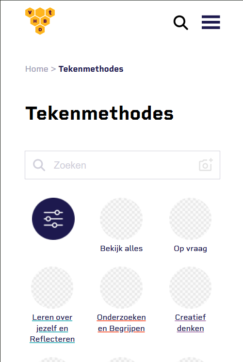
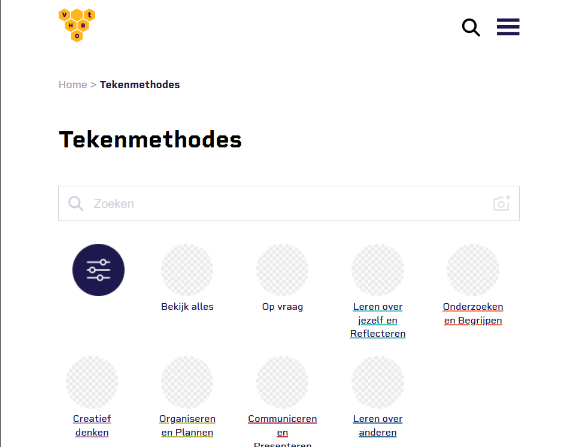

# The Client - Website

Ontwerp en maak een website voor een opdrachtgever en bespreek het resultaat tijdens de Sprint Review.

## Inhoudsopgave Readme

  * [Intro](#intro)
  * [Beschrijving](#beschrijving)
  * [Kenmerken](#kenmerken)
  * [Licentie](#licentie)

## Intro
<!--Begin de Readme met een korte uitleg over de opdracht, schrijf hier bijvoorbeeld de vraag van de opdrachtgever. Maak via GitHub Pages een live URL van je project en voeg deze ook toe aan de Readme.-->

De opdracht is om een website te ontwerpen en te maken voor een opdrachtgever. De opdrachtgeever is Charley Muhren. De vraag van de opdrachtgever is, maak een redesign van de huidige website. Het nieuwe design staat in een Figma Prototype. 

Hier staat de website: https://ayalefevere.github.io/the-client-website/

## Beschrijving
<!-- In de Beschrijving staat hoe je project er uit ziet, hoe het werkt en wat je er mee kan. -->
<!-- Voeg een mooie poster visual toe 📸 -->
<!-- Voeg een link toe naar Github Pages 🌐-->
Dit is het nieuwe design voor de website van Visual Thinking. Op de website kunnen studenten en docenten leren om hun gedachten en doelen te verbeelden. De website bestaat (op dit moment) uit 2 pagina's: home en tekenmethodes. De home pagina hoeft op dit moment niet uitgewerkt worden. Alle pagina's hebben een header en footer. Op de tekenmethodes pagina kun je filteren om de categorieeën van de tekenmethodes te bekijken. Bij de tekenmethode zoals Roadmap kun je stappanplan volgen om meer te leren. De website is responsive voor mobile, tablet en desktop.

Hier staat de website: https://ayalefevere.github.io/the-client-website/

## Kenmerken
<!-- Bij 'Kenmerken' staat welke technieken zijn gebruikt en hoe. Wat is de HTML structuur? Wat zijn de belangrijkste dingen in CSS? Wat is er met JavaScript gedaan en hoe? Wat zijn je conventies? Misschien heb je een framework of library gebruikt? Dit kun je allemaal hier opschrijven.-->

**HTML**
In de header staat de bovenkant van de pagina. Hierin staat de navigatiemenu en icoontjes met een zoek optie voor de hele website, profile icon, favoriete en een button om materiaal te uploaden.

In de main staat alle informatie over de pagina.

In de footer staat

## Licentie

This project is licensed under the terms of the [MIT license](./LICENSE).
